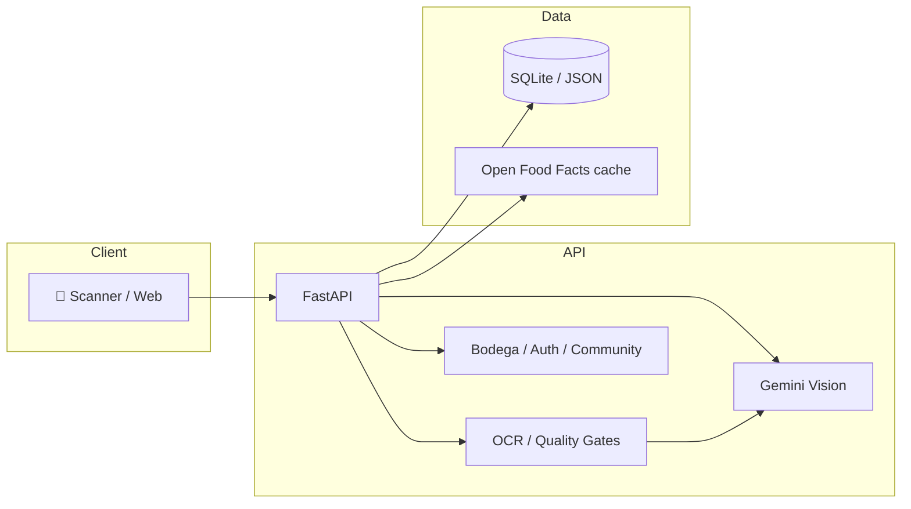

# VINO PRO IA: Experto en Vinos Assistant Tool 🍷

Una herramienta avanzada diseñada para expertos en vinos profesionales que automatiza el análisis de etiquetas de vino mediante un pipeline de OCR e Inteligencia Artificial (Gemini).

---

## 🚀 Características principales

- **Pipeline de escaneo inteligente**: Procesamiento de imágenes para extracción de datos críticos (bodega, año, uva, región) con OCR (Tesseract + OpenCV) y fallback a **Gemini 2.0 Flash**.
- **Quality Gates**: Validaciones automáticas de calidad de imagen (borrosidad, baja luz, reflejos) antes de consumir OCR/IA.
- **Gestión de tráfico**: Rate limiting y semáforos de concurrencia para control de escaneos simultáneos.
- **Optimización de rendimiento**: Sistema de caché con TTL para Open Food Facts (reducción de latencia y costos).
- **Arquitectura robusta**: Preparado para escalar con manejo de errores estructurado. Desplegable en Render, Railway o Docker.
- **Módulos premium**: Stripe, planes freemium, QR personalizados para networking.

---

## 🛠 Stack tecnológico

| Componente | Tecnología |
|------------|------------|
| Backend | Python 3.11, FastAPI |
| OCR | Tesseract, OpenCV (preprocesamiento) |
| IA de visión | Google Gemini 2.0 Flash (`google-genai`) |
| Infraestructura | Docker, Render, Railway |
| Pagos | Stripe |
| Frontend | Jinja2, JavaScript (SPA parcial) |

---

## 🏗 Architecture

End-to-end flow from label scan to storage and AI:



*Current deployment: single service on Render. Reference AWS layout (S3, RDS, optional Lambda) lives in `infrastructure/` for future scaling.*

---

## 📈 Escalability

The system is designed so that growth in users or scan volume can be handled without a full rewrite:

- **Stateless API**: Session and user state are stored in the database and (where needed) in external storage. The app layer can be replicated behind a load balancer (e.g. multiple Render instances or ECS tasks).
- **Async-ready**: Heavy work (OCR, vision, notifications) can be moved to background jobs or serverless functions (e.g. Lambda, Celery, or a queue) so the HTTP API stays fast and resilient.
- **Event streaming**: If event volume grows (scans, analytics, feeds), the architecture is ready to integrate with a message bus (e.g. **Kafka**) or an orchestration layer (e.g. **Airflow**) for batch or real-time pipelines without changing core business logic.
- **Infrastructure as code**: The `infrastructure/` folder contains reference Terraform for an AWS deployment (S3 for uploads, RDS for the database, optional Lambda). This documents the target shape for an enterprise-grade rollout when needed.

---

## ⚙️ Instalación

```bash
# Clonar el repositorio
git clone https://github.com/tu-usuario/vino-pro-ia.git
cd vino-pro-ia/backend_optimized

# Crear y activar entorno virtual
python -m venv venv
source venv/bin/activate   # Linux/macOS
# venv\Scripts\activate   # Windows

# Instalar dependencias
pip install -r requirements.txt

# Copiar variables de entorno
cp .env.example .env
# Editar .env y añadir GOOGLE_API_KEY
```

**Requisitos previos**: Tesseract OCR instalado ([Windows](https://github.com/UB-Mannheim/tesseract/wiki) · `apt-get install tesseract-ocr tesseract-ocr-spa` · `brew install tesseract`).

---

## 🔑 Variables de entorno

| Variable | Descripción |
|----------|-------------|
| `GOOGLE_API_KEY` | API Key de Google AI Studio (Gemini). |
| `VINO_VISION_MODEL` | Modelo de visión (por defecto: `gemini-2.0-flash`). |
| `CORS_ORIGINS` | Orígenes permitidos en producción. |
| `RATE_LIMIT_DEFAULT_PER_MINUTE` | Límite global de peticiones por minuto. |
| `ESCANEO_MAX_CONCURRENT` | Concurrencia máxima del escáner. |

Ver `.env.example` para la lista completa.

---

## 💻 Ejecución

```bash
python render_start.py
```

El servidor estará disponible en `http://127.0.0.1:8000` (o el puerto definido en `PORT`). Documentación interactiva en `/docs`.

---

## 📂 Estructura del proyecto

```
backend_optimized/
├── app.py                 # FastAPI app, CORS, middleware
├── render_start.py        # Punto de entrada producción
├── routes/
│   ├── escaneo.py        # Endpoints de escaneo (OCR + Gemini)
│   ├── bodega.py         # Bodega virtual, historial
│   ├── planes.py         # Suscripciones Stripe
│   └── ...
├── services/
│   ├── ocr_service.py           # Tesseract + preprocesamiento OpenCV
│   ├── vision_wine_service.py   # Gemini 2.0 Flash (fallback visión)
│   ├── image_quality_service.py # Quality Gates (blur, luz, reflejos)
│   ├── busqueda_service.py      # Open Food Facts, caché TTL
│   └── ...
├── middleware/
│   └── runtime_protection.py    # Rate limiting, semáforos
├── infrastructure/              # Reference Terraform (AWS), not used by Render
│   └── main.tf
└── data/                  # Catálogos JSON, config
```

---

## 🛡 Auditoría y optimización

El pipeline de escaneo incluye Quality Gates que verifican:

- **Confianza mínima del OCR** y validación semántica de la respuesta de la IA.
- **Control de semáforos** para evitar saturación en procesos intensivos de CPU/red.
- **Rechazo temprano** de imágenes borrosas, oscuras o con reflejos (OpenCV).
- **Caché TTL** para reducir llamadas repetidas a Open Food Facts.

---

## 👨‍💻 About the Lead Architect

**Yused Correa Mercado** — Project Director & Backend Engineer

*"I specialize in bridging the gap between business needs and high-scale technical solutions. VINO PRO IA is a testament to this, combining computer vision and cloud-native architecture to solve real-world problems in the wine industry.*

*My focus remains on stability, scalability, and security, ensuring that every MVP is built with an enterprise-ready mindset. I am passionate about building APIs that don't just work, but scale."*

---

## 📬 Contacto

¿Te interesa saber más sobre este proyecto o mi perfil profesional?

- **LinkedIn**: [linkedin.com/in/tu-perfil](https://linkedin.com/in/tu-perfil)
- **Portfolio**: [vinoproia.com](https://vinoproia.com)

---

*Licencia: MIT*
